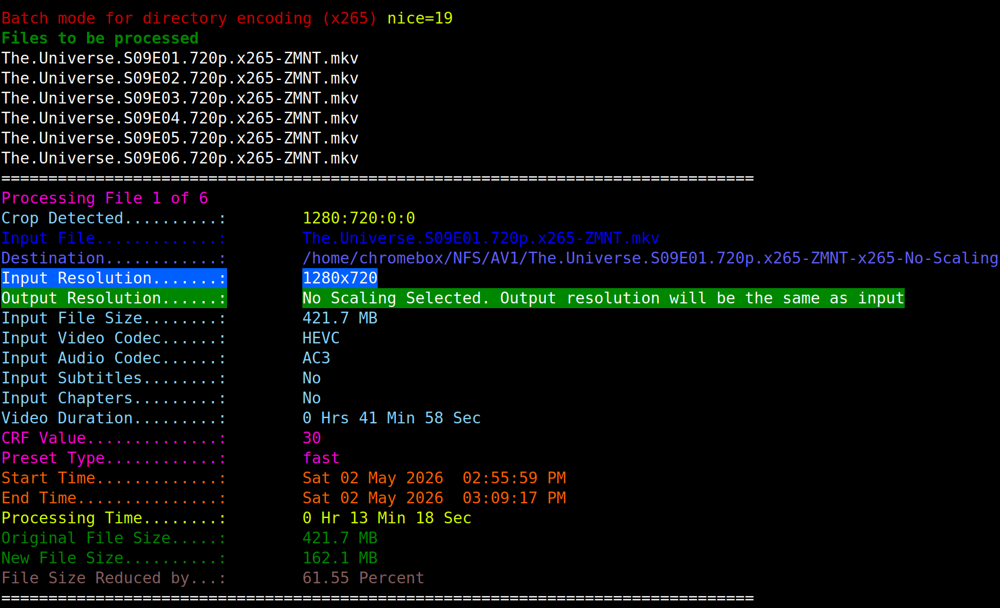

# x265 Batch Encoding

This repository contains a Python wrapper script for batch encoding video files to HEVC (x265) using `ffmpeg`.

## Files

- `x265.py` - batch encoding script with scaling, CRF, preset, nice priority, and adaptive quantization options.

## Requirements

- `python3`
- `ffmpeg` with `libx265` enabled
- `ffprobe`
- `mkvpropedit`
- `tput`

## Usage

Basic usage:

```bash
python3 x265.py /path/to/input.mp4 /path/to/output_dir
```

Example:

```bash
python3 x265.py --crf 28 --preset medium --aq-mode 3 --aq-strength 1.0 --nice 15 /path/to/input.mkv /path/to/output_dir
```

## Screenshot



## Options

- `--nice` - Process nice value for ffmpeg/x265. Higher values reduce scheduler priority.
- `--scale` - Output height in pixels. Use `0` for no scaling.
- `--crf` - CRF value for x265 (`0-51`).
- `--preset` - x265 preset name.
- `--aq-mode` - AQ mode (`0-3`).
- `--aq-strength` - AQ strength (`0.0-3.0`).
- `--depth` - Directory traversal depth for batch mode.

## Notes

- `nice` helps the encoder be less aggressive when other processes need CPU.
- Adaptive quantization is useful for perceptual quality and is enabled through `--aq-mode` and `--aq-strength`.
